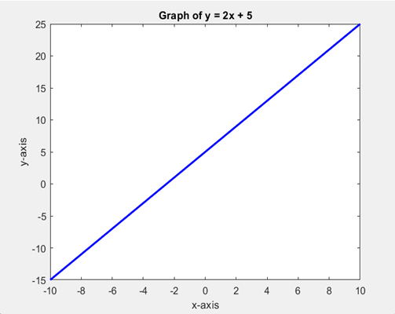

# MATLAB 2D Line Graph: y = 2x + 5

This MATLAB script plots a simple 2D line graph for the equation:

\[
y = 2x + 5
\]

where \( x \) ranges from -10 to 10.

## 📜 Code Explanation

- The `x` values are defined from -10 to 10.
- The `y` values are calculated using the equation \( y = 2x + 5 \).
- The `plot` function is used to create the 2D line graph.
- The line is plotted in blue (`'b'`) with a width of `2` (`'LineWidth', 2`).
- Labels and a title are added for clarity.

## 📈 Output Graph

## 🚀 Usage

1. Open MATLAB.
2. Copy and paste the script into the editor.
3. Run the script to generate the graph.

## 🔧 Requirements

- MATLAB installed on your system.

Enjoy coding! 🚀
